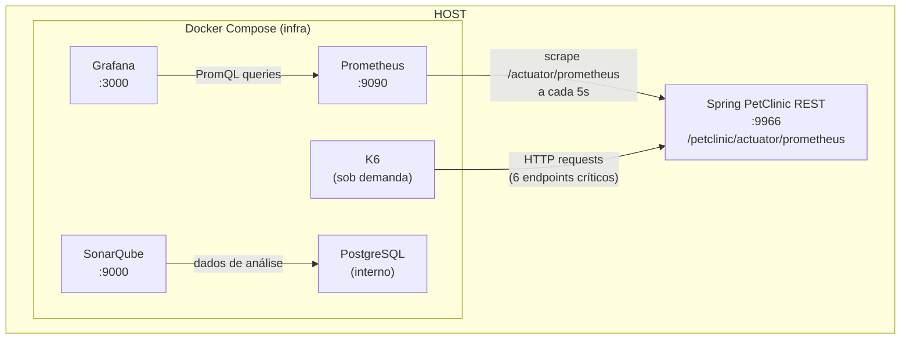

# LEIAME — Infraestrutura de Observabilidade (TCC)

## Visão Geral

Esta pasta contém a **stack de observabilidade Dockerizada** para o projeto de TCC. Todos os serviços são provisionados via Docker Compose e se comunicam com a aplicação Spring PetClinic REST rodando no host (porta 9966).

---

## Arquitetura



---

## Árvore de Arquivos

```
infra/
├── docker-compose.infra.yml        # Orquestração dos serviços
├── prometheus.yml                   # Configuração de scrape do Prometheus
├── grafana/
│   └── provisioning/
│       ├── datasources/
│       │   └── prometheus.yml       # Datasource Prometheus pré-configurado
│       └── dashboards/
│           ├── dashboards.yml       # Provider: define diretório de dashboards
│           ├── tcc-endpoints-k6.json    # Dashboard: métricas de endpoint e carga
│           └── tcc-jvm-spring-boot.json # Dashboard: métricas de runtime JVM
├── k6/
│   └── load-test.js                 # Script de carga (metodologia RED)
└── docs/
    └── guides/
        ├── grafana.md               # Guia detalhado do Grafana
        ├── k6-load-testing.md       # Guia detalhado do K6
        ├── prometheus-micrometer.md # Guia detalhado do Prometheus/Micrometer
        └── sonarqube.md            # Guia detalhado do SonarQube
```

---

## Pré-requisitos

| Requisito | Comando de verificação |
|---|---|
| Docker | `docker --version` |
| Docker Compose v2 | `docker compose version` |
| `vm.max_map_count ≥ 524288` | `sysctl vm.max_map_count` |

```bash
# Ajustar vm.max_map_count (exigido pelo Elasticsearch do SonarQube)
sudo sysctl -w vm.max_map_count=524288
# Para persistir entre reboots:
echo "vm.max_map_count=524288" | sudo tee -a /etc/sysctl.conf
```

---

## Comandos

### Subir a stack completa

```bash
docker compose -f infra/docker-compose.infra.yml up -d
```

### Verificar status

```bash
docker compose -f infra/docker-compose.infra.yml ps
```

### Derrubar a stack

```bash
docker compose -f infra/docker-compose.infra.yml down
```

### Derrubar e limpar volumes (reset total)

```bash
docker compose -f infra/docker-compose.infra.yml down -v
```

### Rodar testes de carga K6

```bash
docker compose -f infra/docker-compose.infra.yml \
  --profile testing run --rm k6 run /scripts/load-test.js
```

---

## Serviços e Portas

| Serviço | Porta | Credenciais | URL |
|---|---|---|---|
| SonarQube | 9000 | admin / admin (primeiro acesso) | http://localhost:9000 |
| Prometheus | 9090 | — | http://localhost:9090 |
| Grafana | 3000 | admin / admin | http://localhost:3000 |
| PostgreSQL (SonarQube) | — (interno) | sonar / sonar | — |
| K6 | — (sob demanda) | — | — |

---

## Configuração do Prometheus

O arquivo `prometheus.yml` define o target de scrape:

```yaml
- job_name: "spring-petclinic-rest"
  metrics_path: "/petclinic/actuator/prometheus"
  scrape_interval: 5s
  static_configs:
    - targets: ["host.docker.internal:9966"]
      labels:
        app: "spring-petclinic-rest"
        fase: "baseline"   # Alterar para "pos-refatoracao" na Fase 3
```

O label `fase` é usado para segmentar dashboards no Grafana entre a coleta baseline e pós-refatoração.

---

## Script K6 — Metodologia RED

O script `k6/load-test.js` exercita os endpoints principais do PetClinic seguindo a metodologia **RED** (Rate, Errors, Duration):

| Endpoint | Método | Métrica K6 |
|---|---|---|
| `/petclinic/api/owners` | GET | `latencia_listar_owners` |
| `/petclinic/api/owners` | POST | `latencia_criar_owner` |
| `/petclinic/api/owners/{id}` | GET | `latencia_consultar_owner` |
| `/petclinic/api/owners/{id}/pets` | POST | `latencia_criar_pet` |
| `/petclinic/api/visits` | POST | `latencia_criar_visit` |
| `/petclinic/api/vets` | GET | `latencia_listar_vets` |
| `/petclinic/actuator/health` | GET | `latencia_health` |

### Perfil de carga (não alterar entre fases)

| Fase | Duração | VUs |
|---|---|---|
| Ramp-up | 30s | 0 → 10 |
| Sustentada | 2min | 10 |
| Spike | 30s | 10 → 50 |
| Estresse | 1min | 50 |
| Ramp-down | 30s | 50 → 0 |

---

## Dashboards Grafana

Dois dashboards são provisionados automaticamente:

1. **tcc-endpoints-k6** — Latência por endpoint, throughput, taxa de erro
2. **tcc-jvm-spring-boot** — Métricas JVM (heap, GC, threads, CPU)

---

## Guias Detalhados

Para informações aprofundadas sobre cada ferramenta, consulte os guias em `docs/guides/`:

- [Grafana](docs/guides/grafana.md) — Provisionamento declarativo, dashboards, alertas
- [K6 Load Testing](docs/guides/k6-load-testing.md) — Metodologia RED, stages, thresholds
- [Prometheus + Micrometer](docs/guides/prometheus-micrometer.md) — Scrape, métricas, histogramas
- [SonarQube](docs/guides/sonarqube.md) — Quality Gates, análise estática, código smells

---

## Troubleshooting

| Problema | Solução |
|---|---|
| SonarQube não inicia | Verificar `vm.max_map_count ≥ 524288` |
| Prometheus não coleta métricas | Verificar se a aplicação está rodando na porta 9966 e se `/petclinic/actuator/prometheus` responde |
| Grafana sem dados | Verificar se o Prometheus está UP em http://localhost:9090/targets |
| K6 falha com connection refused | Verificar se a aplicação está rodando antes de executar o load test |
