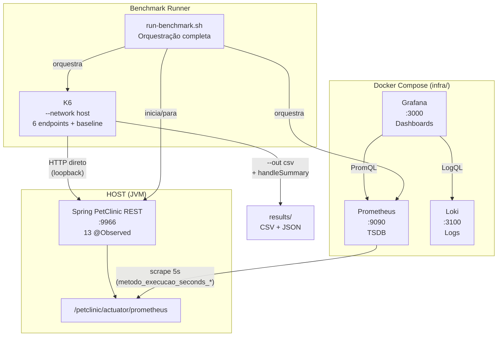

# Infraestrutura de Observabilidade — TCC PetClinic REST

Stack Dockerizada que compõe a infraestrutura experimental do TCC _"Mitigação de Débito Técnico Estrutural: Uma Abordagem Híbrida de Refatoração baseada em Observabilidade e Métricas de Qualidade"_.

## Contexto no TCC

O projeto de pesquisa é dividido em **dois repositórios independentes**:

| Repositório                | Escopo                 | Função no Experimento                                                        |
| -------------------------- | ---------------------- | ---------------------------------------------------------------------------- |
| **spring-petclinic-rest**  | Aplicação sob teste    | Código Java com anomalias estruturais, instrumentação `@Observed`, PMD/ArchUnit |
| **infra** (este)           | Stack de observabilidade | Prometheus, Grafana, K6 — coleta e visualização de métricas dinâmicas        |

A comunicação é via rede: Prometheus (Docker) faz scrape da aplicação (host, porta 9966), e o K6 (`--network host`) envia requisições HTTP via loopback sem overhead de NAT.

---

## Arquitetura



---

## Organização do Repositório

```
infra/
├── docker-compose.yml              # Stack de observabilidade (Prometheus, Grafana, Loki, K6)
├── prometheus.yml                   # Configuração de scrape (target: host:9966)
├── loki-config.yaml                 # Configuração do Loki (agregação de logs)
├── promtail-config.yaml             # Configuração do Promtail (coleta de logs Docker)
├── grafana/
│   └── provisioning/
│       ├── datasources/
│       │   ├── prometheus.yml       # Datasource Prometheus pré-configurado
│       │   └── loki.yml             # Datasource Loki pré-configurado
│       └── dashboards/
│           ├── dashboards.yml       # Provider de dashboards
│           ├── tcc-endpoints-k6.json    # Dashboard RED: Endpoints + @Observed
│           └── tcc-jvm-spring-boot.json # Dashboard JVM: heap, GC, threads
├── k6/
│   └── load-test.js                 # Script de carga (RED + scenarios + handleSummary)
├── scripts/
│   └── run-benchmark.sh             # Orquestração completa do ciclo de benchmark
├── results/                         # Artefatos gerados (CSV, JSON, logs) — gitignored
└── docs/
    └── guides/
        ├── grafana.md               # Guia: dashboards, painéis, interpretação
        ├── k6-load-testing.md       # Guia: metodologia RED, cenários, exportação
        └── prometheus-micrometer.md # Guia: @Observed, modelo de dados, PromQL
```

---

## Pré-requisitos

| Requisito              | Comando de verificação                                     |
| ---------------------- | ---------------------------------------------------------- |
| Docker                 | `docker --version`                                         |
| Docker Compose v2      | `docker compose version`                                   |
| Java 17+               | `java --version`                                           |
| Maven (via wrapper)    | `./mvnw --version` (no diretório `spring-petclinic-rest`)  |
| curl                   | `curl --version`                                           |

---

## Comandos Essenciais

Todos os comandos devem ser executados **a partir do diretório `infra/`**. Como o arquivo se chama `docker-compose.yml` (nome padrão), não é necessário usar `-f`.

### Subir a stack

```bash
cd infra/
docker compose up -d
```

### Verificar status

```bash
docker compose ps
```

### Derrubar (mantém dados)

```bash
docker compose down
```

### Derrubar + limpar volumes (reset total)

```bash
docker compose down -v
```

### Reiniciar um serviço sem derrubar tudo

```bash
# Ex: reiniciar apenas o Grafana
docker compose restart grafana

# Ex: reiniciar apenas o Prometheus
docker compose restart prometheus
```

### Rebuild após alterar `docker-compose.yml`

```bash
# Recria apenas o serviço modificado, sem derrubar os outros
docker compose up -d --force-recreate <serviço>

# Ex: recriar Prometheus com nova config
docker compose up -d --force-recreate prometheus

# Recriar todos
docker compose up -d --force-recreate
```

### Recarregar configuração do Prometheus (sem reiniciar)

```bash
# Usa a API lifecycle (--web.enable-lifecycle já está habilitado)
curl -X POST http://localhost:9090/-/reload
```

### Rodar K6 manualmente (via compose)

```bash
docker compose --profile testing run --rm k6 run /scripts/load-test.js
```

### Rodar K6 com exportação CSV (modo recomendado)

```bash
docker run --rm --network host \
  -v $(pwd)/k6:/scripts:ro \
  -v $(pwd)/results:/results \
  grafana/k6:latest run \
    --out csv=/results/k6-metrics.csv \
    /scripts/load-test.js
```

---

## Serviços e Portas

| Serviço    | Porta | Credenciais     | URL                       |
| ---------- | ----- | --------------- | ------------------------- |
| Prometheus | 9090  | —               | http://localhost:9090      |
| Grafana    | 3000  | admin / admin   | http://localhost:3000      |
| Loki       | 3100  | —               | http://localhost:3100      |
| K6         | —     | sob demanda     | —                         |

---

## Benchmark Automatizado (`run-benchmark.sh`)

O `run-benchmark.sh` é o **método primário** de execução, garantindo reprodutibilidade total.

> **CWD:** o script espera ser executado a partir da raiz do workspace (`tcc/`), **não** de dentro de `infra/`.

```bash
# A partir de tcc/ (raiz do workspace):
bash infra/scripts/run-benchmark.sh baseline
bash infra/scripts/run-benchmark.sh pos-refatoracao

# Ou, se já estiver dentro de infra/:
bash scripts/run-benchmark.sh baseline
bash scripts/run-benchmark.sh pos-refatoracao
```

### Ciclo completo do script

| Etapa   | Ação                             | Justificativa                                    |
| ------- | -------------------------------- | ------------------------------------------------ |
| **1/5** | `docker compose down -v`        | Limpa volumes Prometheus (elimina stale data)    |
| **2/5** | `docker compose up -d`          | Sobe Prometheus + Grafana com health-check       |
| **3/5** | `./mvnw spring-boot:run`        | Inicia Spring Boot com H2 in-memory (banco limpo)|
| **4/5** | K6 `--out csv` + `handleSummary`| Gera CSV granular + JSON summary                 |
| **5/5** | Aguarda último scrape (20s)     | Garante que Prometheus coletou as últimas métricas|

### Artefatos gerados por execução

```
infra/results/
├── k6-metrics-baseline-20260710-143000.csv     # CSV granular (1 linha por data point)
├── k6-summary-baseline-20260710-143000.json    # JSON summary (agregados completos)
└── benchmark-baseline-20260710-143000.log      # Log completo (Spring Boot + k6)
```

---

## Endpoints Exercitados pelo K6

O script exerce **6 endpoints críticos + 1 baseline** de infraestrutura, cobrindo os 13 `@Observed` ativos:

| #  | Endpoint                                              | Método | @Observed Chain                                                                        | Anomalia Correlacionada |
| -- | ----------------------------------------------------- | ------ | -------------------------------------------------------------------------------------- | ----------------------- |
| 1  | `/petclinic/api/owners`                               | GET    | `Controller_Owner_ListAll` → `Service_Owner_FindAll`                                   | N+1 EAGER cascata       |
| 2  | `/petclinic/api/owners`                               | POST   | `Controller_Owner_Add` → `Service_Owner_Save`                                          | Write-path completo     |
| 3  | `/petclinic/api/owners/{id}`                          | GET    | `Controller_Owner_FindById` → `Service_Owner_FindById`                                 | Grafo denso             |
| 4  | `/petclinic/api/owners/{id}/pets`                     | POST   | `Controller_Pet_AddToOwner` → `Service_Owner_FindById` → `Service_PetType_FindById` → `Service_Pet_Save` | CascadeType.ALL         |
| 5  | `/petclinic/api/owners/{id}/pets/{petId}/visits`      | POST   | `Controller_Visit_AddToOwner` → `Service_Visit_Save`                                   | FK tabela filha         |
| 6  | `/petclinic/api/vets`                                 | GET    | `Controller_Vet_ListAll` → `Service_Vet_FindAll`                                       | N:M EAGER               |
| 7  | `/petclinic/actuator/health`                          | GET    | Nenhum (baseline do framework)                                                          | —                       |

---

## Instrumentação: 13 `@Observed` Ativos

### Controller Layer (6)

| contextualName                 | Endpoint HTTP                                   |
| ------------------------------ | ----------------------------------------------- |
| `Controller_Owner_ListAll`     | `GET /api/owners`                               |
| `Controller_Owner_FindById`    | `GET /api/owners/{id}`                          |
| `Controller_Owner_Add`         | `POST /api/owners`                              |
| `Controller_Pet_AddToOwner`    | `POST /api/owners/{id}/pets`                    |
| `Controller_Visit_AddToOwner`  | `POST /api/owners/{id}/pets/{petId}/visits`     |
| `Controller_Vet_ListAll`       | `GET /api/vets`                                 |

### Service Layer (7)

| contextualName                 | Método                        |
| ------------------------------ | ----------------------------- |
| `Service_Owner_FindAll`        | `findAllOwners()`             |
| `Service_Owner_FindById`       | `findOwnerById(id)`           |
| `Service_Owner_Save`           | `saveOwner(owner)`            |
| `Service_Vet_FindAll`          | `findAllVets()`               |
| `Service_PetType_FindById`     | `findPetTypeById(id)`         |
| `Service_Pet_Save`             | `savePet(pet)`                |
| `Service_Visit_Save`           | `saveVisit(visit)`            |

---

## Interpretando os Artefatos Exportados

### CSV Granular (`k6-metrics-*.csv`)

Cada linha é um **data point individual** com timestamp Unix e tags:

```csv
metric_name,timestamp,metric_value,check,error,error_code,group,method,name,proto,scenario,status,url,extra_tags
http_req_duration,1720612800,221.899,,,,,GET,http://localhost:9966/...,HTTP/1.1,steady_state,200,...,
latencia_listar_owners,1720612800,221.899,,,,,,,,steady_state,,,
taxa_erro,1720612800,0.000,,,,,,,,steady_state,,,
```

**Como abrir:**

```python
import pandas as pd

df = pd.read_csv("infra/results/k6-metrics-baseline-20260710-143000.csv")

# Filtrar apenas latência de listar owners na fase de teste
owners = df[
    (df["metric_name"] == "latencia_listar_owners") &
    (df["scenario"] == "steady_state")
]

print(f"p95: {owners['metric_value'].quantile(0.95):.2f} ms")
print(f"p99: {owners['metric_value'].quantile(0.99):.2f} ms")
print(f"Média: {owners['metric_value'].mean():.2f} ms")
```

**O que esperar:** milhares de linhas (uma por requisição HTTP feita pelo k6). As colunas `scenario` e `extra_tags` permitem filtrar `warmup` vs. `steady_state`.

### JSON Summary (`k6-summary-*.json`)

Contém os **agregados completos** calculados pelo k6 ao final do teste:

```json
{
  "metrics": {
    "latencia_listar_owners": {
      "type": "trend",
      "contains": "time",
      "values": {
        "avg": 22500.5,
        "min": 17.88,
        "med": 9140.0,
        "max": 60000.0,
        "p(90)": 60000.0,
        "p(95)": 60000.0,
        "p(99)": 60000.0,
        "count": 2219
      }
    },
    "taxa_erro": {
      "type": "rate",
      "values": { "rate": 0.0382, "passes": 11720, "fails": 465 }
    }
  },
  "thresholds": {
    "latencia_listar_owners": {
      "p(95)<4000": { "ok": false },
      "p(99)<5000": { "ok": false }
    }
  }
}
```

**Como abrir:**

```python
import json

with open("infra/results/k6-summary-baseline-20260710-143000.json") as f:
    data = json.load(f)

# Extrair p95 de todos os endpoints
for name, metric in data["metrics"].items():
    if metric["type"] == "trend" and name.startswith("latencia_"):
        values = metric["values"]
        print(f"{name}: p95={values['p(95)']:.0f}ms  p99={values['p(99)']:.0f}ms  avg={values['avg']:.0f}ms")

# Verificar thresholds
for name, checks in data["thresholds"].items():
    for check, result in checks.items():
        status = "✅ PASS" if result["ok"] else "❌ FAIL"
        print(f"{name} [{check}]: {status}")
```

**O que esperar:** um único objeto JSON com todas as métricas agregadas, checks e thresholds (pass/fail). É o "relatório final" do teste.

---

## Dashboards Grafana

Dois dashboards são provisionados automaticamente como IaC:

### 1. TCC — Endpoints & @Observed (PetClinic)

Três seções:
- **Visão Geral:** taxa de erro, p95 global, throughput por endpoint
- **Latência por Endpoint:** p50/p95/p99 para cada endpoint crítico
- **@Observed:** p95 por `contextualName`, throughput por método, taxa de erro por bean

### 2. TCC — JVM & Spring Boot

Métricas de runtime: heap, GC pause, threads ativas, CPU. Útil para correlacionar degradação de latência com pressão de memória (EAGER carregando grafos).

---

## Configuração do Prometheus

```yaml
- job_name: "spring-petclinic-rest"
  metrics_path: "/petclinic/actuator/prometheus"
  scrape_interval: 5s
  static_configs:
    - targets: ["host.docker.internal:9966"]
      labels:
        app: "spring-petclinic-rest"
        fase: "baseline"   # Alterar para "pos-refatoracao" na Fase 2
```

### Métricas Coletadas

| Métrica                              | Origem                     | Finalidade                                  |
| ------------------------------------ | -------------------------- | ------------------------------------------- |
| `http_server_requests_seconds_*`     | Spring Boot Actuator       | Latência HTTP por endpoint                  |
| `metodo_execucao_seconds_*`          | `@Observed` (Micrometer)   | Latência por camada (Controller/Service)    |
| `jvm_*`, `process_*`                | JVM MBeans                 | Heap, GC, threads, CPU                      |

---

## Guias Detalhados

| Guia                                                           | Conteúdo                                                  |
| -------------------------------------------------------------- | --------------------------------------------------------- |
| [Grafana](docs/guides/grafana.md)                              | Dashboards, interpretação de painéis, exportação          |
| [K6 Load Testing](docs/guides/k6-load-testing.md)             | Metodologia RED, cenários, thresholds, CSV/JSON export    |
| [Prometheus + Micrometer](docs/guides/prometheus-micrometer.md)| Modelo de dados, @Observed, queries PromQL                |

---

## Troubleshooting

| Problema                        | Solução                                                                       |
| ------------------------------- | ----------------------------------------------------------------------------- |
| Prometheus não coleta           | Verificar se a app roda em `:9966` e `/petclinic/actuator/prometheus` responde |
| Grafana sem dados               | Verificar Prometheus UP em http://localhost:9090/targets                       |
| K6 "connection refused"         | Verificar se a aplicação está rodando antes do load test                      |
| @Observed sem dados             | Fazer ao menos 1 requisição ao endpoint (lazy registration do Micrometer)    |
| Porta 9966 em uso               | `fuser -k 9966/tcp` para liberar                                            |
| Benchmark inconsistente         | Usar `run-benchmark.sh` para ciclo completo de limpeza                       |
| Alterei compose, como aplicar?  | `docker compose up -d --force-recreate <serviço>`                            |
| Alterei prometheus.yml          | `curl -X POST http://localhost:9090/-/reload` (hot reload)                   |

---

## Referências

- Richards, M.; Ford, N. (2020). _Fundamentals of Software Architecture_. O'Reilly.
- Ford, N.; Parsons, R.; Kua, P. (2022). _Building Evolutionary Architectures_, 2nd ed. O'Reilly.
- Fowler, M. (2018). _Refactoring_, 2nd ed. Addison-Wesley.
- Valente, M. T. (2026). _Fundamentos de Manutenção de Software_.
