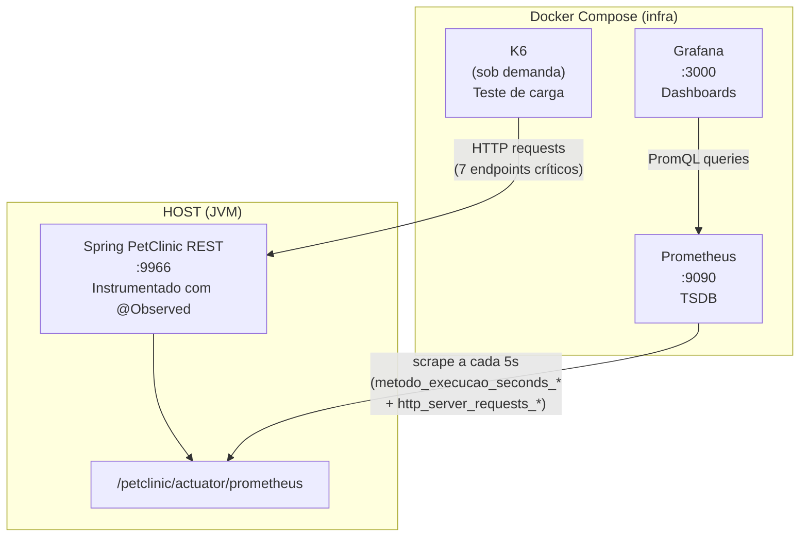

# LEIAME — Infraestrutura de Observabilidade (TCC)

## Contexto no TCC

Este repositório contém a **stack de observabilidade Dockerizada** que compõe a infraestrutura experimental do TCC. O projeto de pesquisa é dividido em **dois sub-projetos independentes**, sob mesma orientação acadêmica, divididos em repositórios separados para manter rastreabilidade:

| Repositório | Escopo | Função no Experimento |
|---|---|---|
| **spring-petclinic-rest** | Aplicação sob teste | Código Java com anomalias estruturais, instrumentação `@Observed`, análise estática |
| **infra** (este) | Stack de observabilidade | Prometheus, Grafana, K6 — coleta e visualização de métricas dinâmicas |

A comunicação entre ambos é via rede: o Prometheus (Docker) faz scrape da aplicação (host, porta 9966), e o K6 (Docker) envia requisições HTTP para os endpoints da API.

---

## Arquitetura



---

## Árvore de Arquivos

```
infra/
├── docker-compose.infra.yml        # Orquestração dos serviços
├── prometheus.yml                   # Configuração de scrape
├── grafana/
│   └── provisioning/
│       ├── datasources/
│       │   └── prometheus.yml       # Datasource pré-configurado
│       └── dashboards/
│           ├── dashboards.yml       # Provider de dashboards
│           ├── tcc-endpoints-k6.json    # Endpoints + @Observed
│           └── tcc-jvm-spring-boot.json # Runtime JVM
├── k6/
│   └── load-test.js                 # Script de carga (metodologia RED)
└── docs/
    └── guides/
        ├── grafana.md               # Guia: visualização e interpretação
        ├── k6-load-testing.md       # Guia: metodologia e perfil de carga
        └── prometheus-micrometer.md # Guia: modelo de dados e PromQL
```

---

## Pré-requisitos

| Requisito | Comando de verificação |
|---|---|
| Docker | `docker --version` |
| Docker Compose v2 | `docker compose version` |

---

## Comandos

### Subir a stack

```bash
docker compose -f infra/docker-compose.infra.yml up -d
```

### Verificar status

```bash
docker compose -f infra/docker-compose.infra.yml ps
```

### Derrubar

```bash
docker compose -f infra/docker-compose.infra.yml down
```

### Reset total (com volumes)

```bash
docker compose -f infra/docker-compose.infra.yml down -v
```

### Rodar testes de carga K6

```bash
docker compose -f infra/docker-compose.infra.yml \
  --profile testing run --rm k6 run /scripts/load-test.js
```

---

## Serviços e Portas

| Serviço | Porta | Credenciais | URL |
|---|---|---|---|
| Prometheus | 9090 | — | http://localhost:9090 |
| Grafana | 3000 | admin / admin | http://localhost:3000 |
| K6 | — (sob demanda) | — | — |

---

## Configuração do Prometheus

```yaml
- job_name: "spring-petclinic-rest"
  metrics_path: "/petclinic/actuator/prometheus"
  scrape_interval: 5s
  static_configs:
    - targets: ["host.docker.internal:9966"]
      labels:
        app: "spring-petclinic-rest"
        fase: "baseline"   # Alterar para "pos-refatoracao" na Fase 2
```

O label `fase` segmenta os dados no Grafana entre coleta baseline e pós-refatoração.

### Métricas Coletadas

| Métrica | Origem | Finalidade |
|---|---|---|
| `http_server_requests_seconds_*` | Spring Boot Actuator | Latência HTTP por endpoint |
| `metodo_execucao_seconds_*` | `@Observed` (Micrometer) | Latência por camada (Controller/Service) |
| `jvm_*`, `process_*` | JVM MBeans | Heap, GC, threads, CPU |

---

## Script K6 — Perfil de Carga

| Fase | Duração | VUs | Objetivo |
|---|---|---|---|
| Ramp-up | 30s | 0 → 30 | Aquecimento JIT |
| Sustentada | 1min | 30 → 50 | Baseline de operação |
| Spike | 30s | 50 → 100 | Transição abrupta |
| Estresse | 1min | 100 | Degradação acumulativa |
| Ramp-down | 30s | 100 → 0 | Recuperação |

### Endpoints Exercitados

| Endpoint | Método | Anomalia Correlacionada |
|---|---|---|
| `/petclinic/api/owners` | GET | N+1 EAGER cascata |
| `/petclinic/api/owners` | POST | Write-path completo |
| `/petclinic/api/owners/{id}` | GET | Grafo denso |
| `/petclinic/api/owners/{id}/pets` | POST | CascadeType.ALL |
| `/petclinic/api/owners/{ownerId}/pets/{petId}/visits` | POST | FK em tabela filha |
| `/petclinic/api/vets` | GET | N:M EAGER |
| `/petclinic/actuator/health` | GET | Baseline framework |

---

## Dashboards Grafana

Dois dashboards são provisionados automaticamente:

### 1. TCC — Endpoints & @Observed (PetClinic)

Três seções:
- **Visão Geral:** taxa de erro, p95 global, throughput por endpoint
- **Latência por Endpoint:** p50/p95/p99 para cada endpoint crítico
- **@Observed:** p95 por `contextualName`, throughput por método, taxa de erro por bean

### 2. TCC — JVM & Spring Boot

Métricas de runtime: heap, GC pause, threads ativas, CPU. Útil para correlacionar degradação de latência com pressão de memória (EAGER carregando grafos grandes).

---

## Guias Detalhados

| Guia | Conteúdo |
|---|---|
| [Grafana](docs/guides/grafana.md) | Dashboard @Observed, interpretação de painéis, exportação de dados |
| [K6 Load Testing](docs/guides/k6-load-testing.md) | Metodologia RED, perfil de carga, thresholds como fitness functions |
| [Prometheus + Micrometer](docs/guides/prometheus-micrometer.md) | Modelo de dados, @Observed, queries PromQL |

---

## Troubleshooting

| Problema | Solução |
|---|---|
| Prometheus não coleta | Verificar se a app roda na porta 9966 e `/petclinic/actuator/prometheus` responde |
| Grafana sem dados | Verificar Prometheus UP em http://localhost:9090/targets |
| K6 "connection refused" | Verificar se a aplicação está rodando antes do load test |
| @Observed sem dados | Fazer ao menos 1 requisição ao endpoint instrumentado (lazy registration) |
