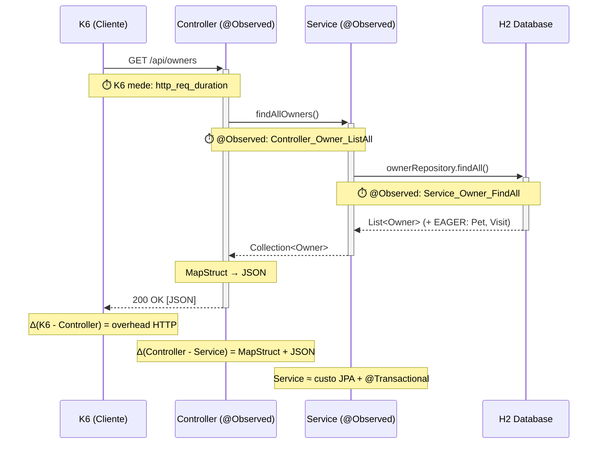

# Testes de Carga com K6

## Visão Geral Metodológica

O K6 é uma ferramenta de teste de carga baseada em scripts JavaScript (ES6+) desenvolvida pela Grafana Labs. Neste projeto, o K6 é responsável pela coleta de **métricas dinâmicas de carga**, complementando a observabilidade passiva do Prometheus/Micrometer.

A distinção entre as duas abordagens é fundamental para o TCC:

| Perspectiva | Ferramenta | O que mede | Onde reside |
|---|---|---|---|
| **Cliente** | K6 | Tempo ponta a ponta (inclui rede + serialização HTTP) | Container Docker |
| **Servidor** | Micrometer (`@Observed`) | Tempo de processamento por camada (Controller, Service) | Dentro da JVM |

Em ambiente controlado (loopback Docker), a diferença entre as medições é negligenciável — mas a complementaridade é rica: o K6 fornece a visão do "usuário" enquanto `@Observed` fornece a visão do "engenheiro". A correlação entre ambas valida que a degradação medida no servidor se manifesta na experiência do cliente.

---

## Relação K6 ↔ @Observed



---

## Modelo de Carga: Metodologia RED

O script implementa a **metodologia RED** (Rate, Errors, Duration) proposta por Tom Wilkie (Grafana Labs), que Richards e Ford (2020) recomendam como padrão de observabilidade para microsserviços — igualmente aplicável a monolitos modulares.

| Dimensão | O que mede | Métrica K6 |
|---|---|---|
| **Rate** | Requisições por segundo | `http_reqs` |
| **Errors** | Proporção de falhas | `taxa_erro` (Rate customizado) |
| **Duration** | Latência das requisições | `http_req_duration` + Trends por endpoint |

---

## Perfil de Carga

O perfil escalonado exercita a aplicação em diferentes níveis de concorrência, revelando comportamentos não-lineares causados por débito técnico:

```mermaid
gantt
    title Perfil de Carga K6 — 3min30s total
    dateFormat ss
    axisFormat %S

    section Fases
    Ramp-up 0→30 VUs       :a1, 00, 30s
    Sustentada 50 VUs       :a2, after a1, 60s
    Spike 50→100 VUs        :a3, after a2, 30s
    Estresse 100 VUs        :a4, after a3, 60s
    Ramp-down 100→0         :a5, after a4, 30s
```



| Fase | Duração | VUs | Objetivo Experimental |
|---|---|---|---|
| **Ramp-up** | 30s | 0 → 30 | Aquecimento JIT da JVM. Resultados descartáveis. |
| **Sustentada** | 1min | 30 → 50 | Carga moderada — baseline de operação normal |
| **Spike** | 30s | 50 → 100 | Transição abrupta — revela N+1 e contenção de locks |
| **Estresse** | 1min | 100 | Carga máxima sustentada — evidencia degradação acumulativa |
| **Ramp-down** | 30s | 100 → 0 | Recuperação — verifica liberação de recursos |

> **Justificativa do spike:** Fowler (2018) observa que code smells frequentemente são "invisíveis sob carga baixa e catastróficos sob carga alta". O spike de 50→100 VUs é desenhado para provocar essa transição — se `GET /owners` com EAGER N+1 escala linearmente até 50 VUs mas quadraticamente além, o spike torna isso visível.

> **Princípio de comparabilidade:** para que a comparação baseline × pós-refatoração seja metodologicamente válida, **nenhum parâmetro** do script (stages, thresholds, payloads) pode ser alterado entre as fases. Apenas o código Java muda. Isso isola a variável independente (refatoração) da variável dependente (latência).

---

## Thresholds como Fitness Functions

Os thresholds do K6 funcionam como *fitness functions automatizadas* (Ford, Parsons e Kua, 2017): critérios de aceitação formalizados que protegem características operacionais.

```javascript
thresholds: {
    http_req_duration:        ['p(95)<5000'],    // SLO global
    taxa_erro:                ['rate<0.10'],      // < 10% de erros
    latencia_listar_owners:   ['p(95)<4000'],    // N+1 EAGER
    latencia_criar_owner:     ['p(95)<3000'],    // write-path
    latencia_consultar_owner: ['p(95)<3000'],    // grafo denso
    latencia_criar_pet:       ['p(95)<3000'],    // cascata JPA
    latencia_criar_visit:     ['p(95)<3000'],    // inserção filha
    latencia_listar_vets:     ['p(95)<2000'],    // N:M EAGER
    latencia_health:          ['p(95)<500'],     // baseline framework
}
```

O K6 retorna exit code 99 quando um threshold é violado. No contexto do TCC:
- **Violação no baseline:** confirma que o débito técnico causa degradação mensurável
- **Aprovação no pós-refatoração:** confirma que a refatoração melhorou a fitness function

---

## Métricas Customizadas

| Métrica K6 | Tipo | Endpoint | Anomalia Correlacionada |
|---|---|---|---|
| `latencia_listar_owners` | Trend | `GET /owners` | N+1 via EAGER cascata |
| `latencia_criar_owner` | Trend | `POST /owners` | Write-path completo |
| `latencia_consultar_owner` | Trend | `GET /owners/{id}` | Grafo denso |
| `latencia_criar_pet` | Trend | `POST /owners/{id}/pets` | CascadeType.ALL |
| `latencia_criar_visit` | Trend | `POST .../visits` | FK em tabela filha |
| `latencia_listar_vets` | Trend | `GET /vets` | N:M EAGER |
| `latencia_health` | Trend | `GET /actuator/health` | Baseline (sem negócio) |
| `taxa_erro` | Rate | Todos | Estabilidade global |
| `owners_criados_com_sucesso` | Counter | `POST /owners` | Throughput efetivo |

---

## Interpretação dos Resultados

### Saída do Terminal

```
http_req_duration........: avg=1.2s  min=42ms  med=890ms  max=4.1s  p(90)=2.8s  p(95)=3.4s
```

- **`avg`:** sensível a outliers — usar com cautela como métrica primária
- **`med` (p50):** tempo "típico" — insensível a outliers
- **`p(95)`:** critério padrão para SLOs (Ford, Parsons e Kua, 2017)
- **`max`:** cauda extrema — pode revelar N+1 acumulado ou GC pause

> A diferença `p95 - p50` é um indicador de variabilidade: se alta, sugere comportamento não-determinístico (EAGER com volume variável, GC pause, contenção).

---

## Protocolo de Coleta de Dados

Para garantir validade metodológica:

1. Verificar que a aplicação está estabilizada (uptime > 60s, JVM aquecida)
2. Executar o teste com saída persistida
3. Capturar screenshot do dashboard Grafana ao final
4. Exportar CSV dos painéis de latência
5. Registrar timestamps de início e fim
6. Salvar artefatos em `docs/results/baseline/` ou `docs/results/pos-refatoracao/`

```bash
docker compose -f infra/docker-compose.infra.yml \
  --profile testing run --rm k6 run /scripts/load-test.js \
  2>&1 | tee docs/results/baseline/k6-summary-$(date +%Y%m%dT%H%M).txt
```

---

## Referências

- Richards, M.; Ford, N. (2020). *Fundamentals of Software Architecture*. O'Reilly.
- Ford, N.; Parsons, R.; Kua, P. (2017). *Building Evolutionary Architectures*. O'Reilly.
- Fowler, M. (2018). *Refactoring*, 2nd ed. Addison-Wesley.
