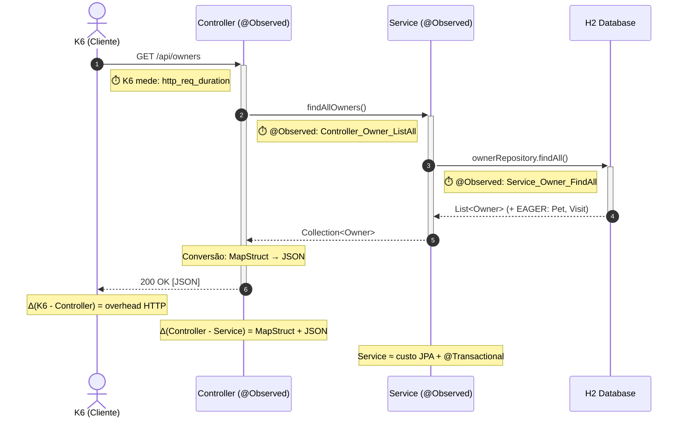

# Testes de Carga com K6

## Visão Geral Metodológica

O K6 é uma ferramenta de teste de carga baseada em scripts JavaScript (ES6+) desenvolvida pela Grafana Labs. Neste projeto, o K6 é responsável pela coleta de **métricas dinâmicas de carga**, complementando a observabilidade passiva do Prometheus/Micrometer.

A distinção entre as duas abordagens é fundamental para o TCC:

| Perspectiva  | Ferramenta               | O que mede                                              | Onde reside                       |
| ------------ | ------------------------ | ------------------------------------------------------- | --------------------------------- |
| **Cliente**  | K6                       | Tempo ponta a ponta (inclui rede + serialização HTTP)   | `--network host` (direto no host) |
| **Servidor** | Micrometer (`@Observed`) | Tempo de processamento por camada (Controller, Service) | Dentro da JVM                     |

Em execução com `--network host`, a latência de rede entre K6 e a aplicação é eliminada — o tráfego ocorre via loopback (`localhost`), sem traversar a camada NAT do Docker bridge. Isso garante que os percentis P95/P99 meçam exclusivamente o tempo de processamento da aplicação.

---

## Relação K6 ↔ @Observed (13 pontos de instrumentação)



---

## Modelo de Carga: Metodologia RED

O script implementa a **metodologia RED** (Rate, Errors, Duration) proposta por Tom Wilkie (Grafana Labs), que Richards e Ford (2020) recomendam como padrão de observabilidade para microsserviços — igualmente aplicável a monolitos modulares.

| Dimensão     | O que mede               | Métrica K6                                |
| ------------ | ------------------------ | ----------------------------------------- |
| **Rate**     | Requisições por segundo  | `http_reqs`                               |
| **Errors**   | Proporção de falhas      | `taxa_erro` (Rate customizado)            |
| **Duration** | Latência das requisições | `http_req_duration` + Trends por endpoint |

---

## Perfil de Carga (Scenarios)

O K6 utiliza dois **cenários separados** (`warmup` e `steady_state`) com tags de fase para isolamento de métricas. Isso permite exclusão matemática dos dados de warm-up JIT do relatório final — impossível com `stages` simples.

| Cenário        | Fase                | Duração | VUs      | Tag            | Nos Thresholds |
| -------------- | ------------------- | ------- | -------- | -------------- | -------------- |
| `warmup`       | Ramp-up             | 30s     | 0 → 30   | `phase:warmup` | ❌ Excluído    |
| `steady_state` | Aquecimento JIT     | 1min    | 30       | `phase:test`   | ✅ Incluído    |
| `steady_state` | Carga nominal       | 3min    | 50       | `phase:test`   | ✅ Incluído    |
| `steady_state` | Spike               | 1min    | 50 → 100 | `phase:test`   | ✅ Incluído    |
| `steady_state` | Estresse sustentado | 7min    | 100      | `phase:test`   | ✅ Incluído    |
| `steady_state` | Ramp-down           | 1min    | 100 → 0  | `phase:test`   | ✅ Incluído    |
| `steady_state` | Cooldown            | 2min    | 0        | `phase:test`   | ✅ Incluído    |

> **Justificativa do isolamento:** O K6 não permite excluir dados de stages do relatório final. A separação em cenários com tags permite filtrar métricas por `{phase:test}` nos thresholds — apenas dados da fase de teste efetiva são avaliados.

> **Justificativa do spike:** Fowler (2018) observa que code smells são frequentemente "invisíveis sob carga baixa e catastróficos sob carga alta". O spike de 50→100 VUs provoca essa transição.

> **Princípio de comparabilidade:** para comparação baseline × pós-refatoração, **nenhum parâmetro** do script (scenarios, thresholds, payloads) pode ser alterado. Apenas o código Java muda. Isso isola a variável independente (refatoração) da variável dependente (latência).

---

## Thresholds como Fitness Functions

Os thresholds funcionam como _fitness functions automatizadas_ (Ford, Parsons e Kua, 2022):

```javascript
thresholds: {
    http_req_duration:        ['p(95)<5000'],         // SLO global
    taxa_erro:                ['rate<0.10'],           // < 10% de erros

    // p95 + p99 por endpoint (ambos avaliados)
    latencia_listar_owners:   ['p(95)<4000', 'p(99)<5000'],
    latencia_criar_owner:     ['p(95)<3000', 'p(99)<4000'],
    latencia_consultar_owner: ['p(95)<3000', 'p(99)<4000'],
    latencia_criar_pet:       ['p(95)<3000', 'p(99)<4000'],
    latencia_criar_visit:     ['p(95)<3000', 'p(99)<4000'],
    latencia_listar_vets:     ['p(95)<2000', 'p(99)<3000'],

    // Taxa de erro por endpoint
    erro_listar_owners:       ['rate<0.10'],
    // ... (6 endpoints)
}
```

O K6 retorna exit code 99 quando um threshold é violado:

- **Violação no baseline:** confirma que o débito técnico causa degradação mensurável
- **Aprovação no pós-refatoração:** confirma que a refatoração melhorou a fitness function

---

## Métricas Customizadas por Endpoint

| Métrica K6                   | Tipo    | Endpoint                 | @Observed Chain                                                                                                    | Anomalia              |
| ---------------------------- | ------- | ------------------------ | ------------------------------------------------------------------------------------------------------------------ | --------------------- |
| `latencia_listar_owners`     | Trend   | `GET /owners`            | `Controller_Owner_ListAll` → `Service_Owner_FindAll` (2 spans)                                                     | N+1 EAGER cascata     |
| `latencia_criar_owner`       | Trend   | `POST /owners`           | `Controller_Owner_Add` → `Service_Owner_Save` (2 spans)                                                            | Write-path completo   |
| `latencia_consultar_owner`   | Trend   | `GET /owners/{id}`       | `Controller_Owner_FindById` → `Service_Owner_FindById` (2 spans)                                                   | Grafo denso           |
| `latencia_criar_pet`         | Trend   | `POST /owners/{id}/pets` | `Controller_Pet_AddToOwner` → `Service_Owner_FindById` → `Service_PetType_FindById` → `Service_Pet_Save` (4 spans) | CascadeType.ALL       |
| `latencia_criar_visit`       | Trend   | `POST .../visits`        | `Controller_Visit_AddToOwner` → `Service_Visit_Save` (2 spans)                                                     | FK tabela filha       |
| `latencia_listar_vets`       | Trend   | `GET /vets`              | `Controller_Vet_ListAll` → `Service_Vet_FindAll` (2 spans)                                                         | N:M EAGER             |
| `latencia_health`            | Trend   | `GET /actuator/health`   | Nenhum (baseline)                                                                                                  | Overhead do framework |
| `taxa_erro`                  | Rate    | Todos                    | —                                                                                                                  | Estabilidade global   |
| `erro_*`                     | Rate    | Por endpoint             | —                                                                                                                  | Isolamento de falhas  |
| `owners_criados_com_sucesso` | Counter | `POST /owners`           | —                                                                                                                  | Throughput efetivo    |
| `pets_criados_com_sucesso`   | Counter | `POST .../pets`          | —                                                                                                                  | Throughput efetivo    |
| `visits_criadas_com_sucesso` | Counter | `POST .../visits`        | —                                                                                                                  | Throughput efetivo    |

---

## Exportação de Resultados

O k6 gera **dois artefatos complementares** para análise Python:

### 1. CSV Granular (`--out csv`)

Cada data point é gravado individualmente com timestamp e tags:

```csv
metric_name,timestamp,metric_value,check,error,error_code,group,method,name,proto,scenario,status,url,extra_tags
http_req_duration,1595325560,221.899,,,,,GET,http://localhost:9966/...,HTTP/1.1,steady_state,200,...,
latencia_listar_owners,1595325560,221.899,,,,GET /owners,,,,steady_state,,,
```

**Uso:** séries temporais para plots de evolução ao longo do teste (latência vs. tempo, VUs vs. throughput).

### 2. JSON Summary (`handleSummary()`)

Agregados completos ao final do teste:

```json
{
  "metrics": {
    "latencia_listar_owners": {
      "type": "trend",
      "values": {
        "avg": 22500.5,
        "min": 17.88,
        "med": 9140.0,
        "max": 60000.0,
        "p(90)": 60000.0,
        "p(95)": 60000.0,
        "p(99)": 60000.0,
        "count": 2219
      }
    }
  },
  "root_group": { "checks": [...] },
  "thresholds": { "latencia_listar_owners": { "ok": false } }
}
```

**Uso:** tabelas comparativas baseline × pós-refatoração, cálculo de médias e desvios padrão.

---

## Execução

### Método Primário: `run-benchmark.sh`

Orquestra o ciclo completo (limpeza → infra → app → K6 → coleta):

```bash
# Benchmark baseline (pré-refatoração)
bash infra/scripts/run-benchmark.sh baseline

# Benchmark pós-refatoração
bash infra/scripts/run-benchmark.sh pos-refatoracao
```

Artefatos gerados em `infra/results/`:

- `k6-metrics-{label}-{timestamp}.csv` — dados granulares
- `k6-summary-{label}-{timestamp}.json` — resumo agregado
- `benchmark-{label}-{timestamp}.log` — log completo

### Método Manual: Docker `--network host`

```bash
# Com CSV output
docker run --rm --network host \
  -v $(pwd)/infra/k6:/scripts:ro \
  -v $(pwd)/infra/results:/results \
  grafana/k6:latest run \
    --out csv=/results/k6-metrics.csv \
    /scripts/load-test.js
```

---

## Protocolo de Coleta de Dados

Para garantir validade metodológica (conforme orientação da banca — repetição e dispersão):

1. Executar `run-benchmark.sh` **N vezes** em cada cenário (mínimo 5 execuções)
2. Coletar os `k6-summary-*.json` de cada execução
3. Alimentar o notebook Python para cálculo de:
   - Médias e desvios padrão por métrica
   - Testes de hipótese (Mann-Whitney U) entre baseline e pós-refatoração
4. Os CSVs granulares permitem plots de evolução temporal

---
