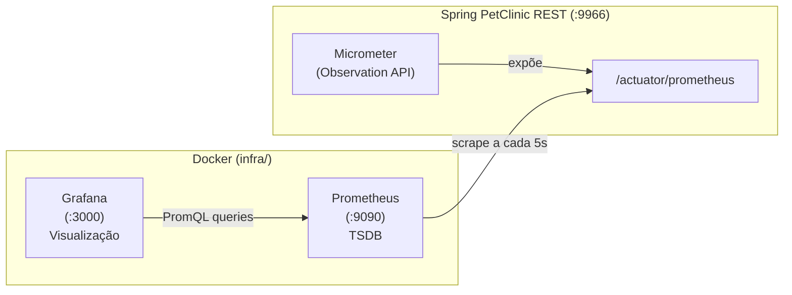

# Observabilidade Dinâmica com Prometheus e Micrometer

## Visão Geral Arquitetural

O pipeline de observabilidade dinâmica segue o padrão **Push-Pull** de telemetria estabelecido pela CNCF: a aplicação instrumentada expõe métricas no formato OpenMetrics via endpoint dedicado, e o Prometheus as captura periodicamente (*scrape*). O Grafana consome os dados do TSDB e os apresenta em painéis analíticos.



Richards e Ford (2020) classificam observabilidade como uma *fitness function operacional*: ela não testa funcionalidade, mas protege características de runtime (latência, throughput, erro). Este pipeline implementa essa visão — as métricas são a evidência empírica do impacto do débito técnico.

---

## Modelo de Dados do Prometheus

| Tipo | Descrição | Uso neste projeto |
|---|---|---|
| **Counter** | Monotonicamente crescente | Total de requisições (`_total`) |
| **Gauge** | Valor instantâneo | Heap JVM, threads ativas |
| **Histogram** | Distribui observações em buckets `le` | Latência HTTP (`_bucket`, `_sum`, `_count`) |
| **Summary** | Percentis pré-calculados | Não utilizado (preferimos Histogram) |

> **Decisão arquitetural:** este projeto usa **Histogram** (não Summary) para métricas de latência. Histogramas permitem calcular percentis arbitrários no servidor via `histogram_quantile()` e agregar dados de múltiplas instâncias. O trade-off é maior cardinalidade de séries temporais — aceitável em ambiente controlado de pesquisa. (Richards e Ford, 2020: "todo trade-off é contextual".)

### Configuração obrigatória

```properties
management.metrics.distribution.percentiles-histogram.http.server.requests=true
```

Habilita a publicação de linhas `_bucket{le="..."}` para cada bucket, permitindo:

```promql
histogram_quantile(0.95, sum(rate(http_server_requests_seconds_bucket[1m])) by (le))
```

---

## Instrumentação via Observation API (`@Observed`)

A **Observation API** (Micrometer 1.10+, integrada ao Spring Boot 3.x/4.x) é o mecanismo principal de instrumentação granular deste TCC. Uma única `Observation` propaga contexto para métricas sem alteração no código de negócio — alinhado com o princípio de Fowler (2018) de que instrumentação não deve alterar o comportamento observável.

### Configuração

```java
@Configuration(proxyBeanMethods = false)
public class ObservabilityConfig {
    @Bean
    ObservedAspect observedAspect(ObservationRegistry registry) {
        return new ObservedAspect(registry);
    }
}
```

### Convenção de Nomenclatura

Todas as anotações `@Observed` neste projeto seguem a mesma convenção:

```java
@Observed(name = "metodo.execucao", contextualName = "Service_Owner_FindAll")
```

- **`name = "metodo.execucao"`** — fixo para todas as observações. Gera a métrica `metodo_execucao_seconds_*` no Prometheus. O `name` fixo permite agregar todas as observações numa única query PromQL.
- **`contextualName = "[Camada]_[Entidade]_[Ação]"`** — identificador único. Aparece como tag `spring_observation_contextual_name` no Prometheus.

> **Decisão:** usar `name` fixo em vez de `name` por bean (ex: `clinic.service`, `owner.controller`) simplifica a agregação: uma única query retorna todas as séries, filtráveis por `contextualName`. O trade-off é que não se pode usar `name` para distinguir beans — mas o `contextualName` cumpre essa função.

### Métricas Geradas

Para cada método anotado, o Prometheus recebe:

| Série | Tags | Semântica |
|---|---|---|
| `metodo_execucao_seconds_bucket` | `le`, `class`, `method`, `error`, `spring_observation_contextual_name` | Distribuição de latência |
| `metodo_execucao_seconds_count` | `class`, `method`, `error`, `spring_observation_contextual_name` | Total de invocações |
| `metodo_execucao_seconds_sum` | `class`, `method`, `error`, `spring_observation_contextual_name` | Soma acumulada |

A tag `error` assume `"none"` em execuções normais ou o nome da exceção capturada (ex: `"RuntimeException"`).

### Restrições

- Funciona apenas em **Spring Beans** gerenciados pelo contexto
- Não intercepta chamadas internas à mesma classe (*self-invocation*)
- Não funciona em proxies já criados pelo Spring Data JPA (razão pela qual o Repository não é instrumentado diretamente — ver [instrumentacao-dinamica-observability.md](../../spring-petclinic-rest/docs/instrumentacao-dinamica-observability.md))

---

## Consultas PromQL de Referência

### Latência p95 global

```promql
histogram_quantile(0.95,
  sum(rate(http_server_requests_seconds_bucket{job="spring-petclinic-rest"}[1m])) by (le)
) * 1000
```

### Latência p95 por endpoint

```promql
histogram_quantile(0.95,
  sum(rate(http_server_requests_seconds_bucket{
    job="spring-petclinic-rest", uri="/api/owners", method="GET"
  }[1m])) by (le)
) * 1000
```

> O `uri` corresponde ao **template da rota** registrado pelo Spring MVC (ex: `/api/owners/{ownerId}`), não à URL real.

### Taxa de erro

```promql
100 *
  sum(rate(http_server_requests_seconds_count{
    job="spring-petclinic-rest", outcome=~"CLIENT_ERROR|SERVER_ERROR"
  }[2m]))
/
  sum(rate(http_server_requests_seconds_count{job="spring-petclinic-rest"}[2m]))
```

> Use `outcome` (semântico: `SUCCESS`, `CLIENT_ERROR`, `SERVER_ERROR`), não `status` (numérico: `200`, `400`).

### p95 por @Observed (comparação cross-camada)

```promql
histogram_quantile(0.95,
  sum(rate(metodo_execucao_seconds_bucket{job="spring-petclinic-rest"}[1m]))
  by (le, spring_observation_contextual_name)
) * 1000
```

### Delta Controller - Service (overhead de serialização)

```promql
histogram_quantile(0.95,
  sum(rate(metodo_execucao_seconds_bucket{
    spring_observation_contextual_name="Controller_Owner_ListAll"
  }[1m])) by (le)
) * 1000
-
histogram_quantile(0.95,
  sum(rate(metodo_execucao_seconds_bucket{
    spring_observation_contextual_name="Service_Owner_FindAll"
  }[1m])) by (le)
) * 1000
```

### Throughput por @Observed

```promql
sum by (spring_observation_contextual_name) (
  rate(metodo_execucao_seconds_count{job="spring-petclinic-rest"}[1m])
)
```

---

## Considerações sobre Cardinalidade

Histogramas têm custo em cardinalidade: cada combinação de labels gera uma série temporal. Para o ambiente controlado deste TCC (endpoints fixos, labels estáticos, sem IDs dinâmicos), o custo é negligenciável. Em produção, labels dinâmicos (ex: user_id) seriam antipadrão — mas não se aplicam aqui.

---

## Referências

- Richards, M.; Ford, N. (2020). *Fundamentals of Software Architecture*. O'Reilly.
- Fowler, M. (2018). *Refactoring*, 2nd ed. Addison-Wesley.
